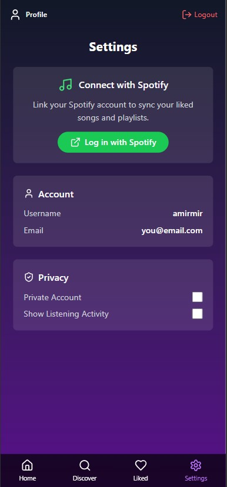
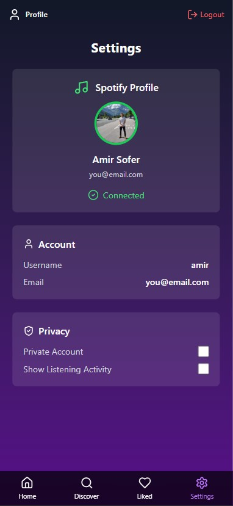

# 🎵 GooseChase — AI-Powered Music Discovery App

GooseChase is a music discovery app that learns your taste by showing you short 20-second song previews based on your preferences. You react by swiping left or right to express how you feel about the song. Behind the scenes, we use Spotify data, user feedback, and AI to recommend better songs over time.

---

## 🖼️ Preview

### 🔍 Discover Page

### ⚙️ Settings Screens

  
  

---

## 🔧 Tech Stack

- **Frontend:** React (with swipe gesture support)
- **Backend:** Node.js + TypeScript + Express
- **Database:** Prisma + SQLite (dev) / PostgreSQL (planned)
- **AI Integration:** OpenAI API for music recommendation logic
- **Data Enrichment:** Spotify API + Last.fm

---

## 🚀 Features

- 🎵 Fetch 20-second Spotify previews
- 💬 Swipe left or right to express preferences
- 🤖 Backend generates music recommendations based on your vibe
- 🧠 Builds a unique user profile using genres, tempo, mood, and lyrics
- 🔐 JWT-based user authentication

---
